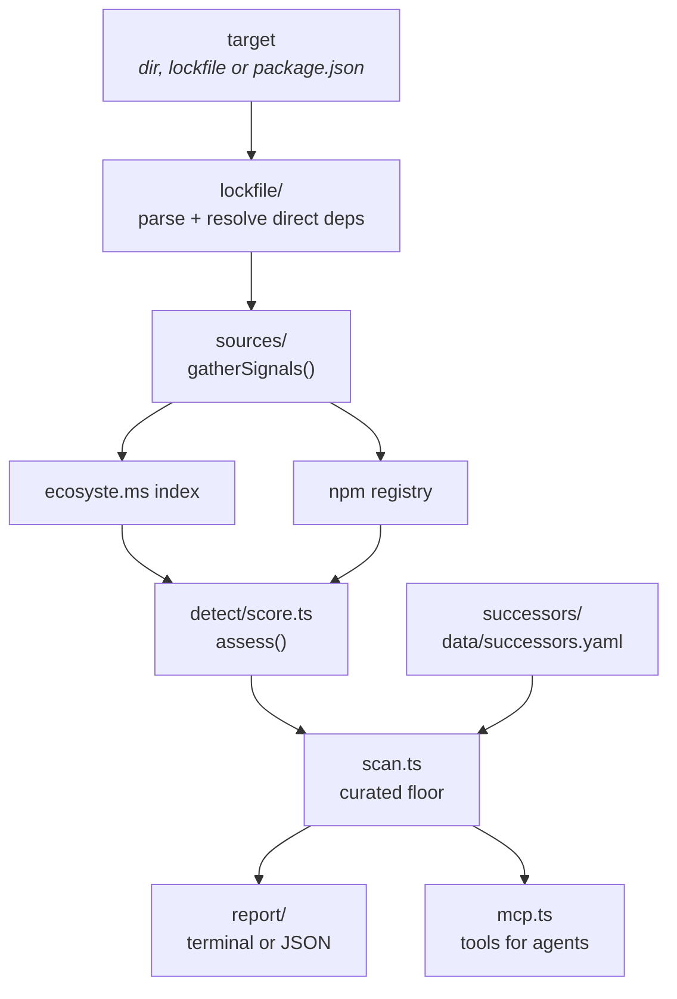

# Architecture

A map of the codebase for anyone reading it for the first time. For *why* the
verdicts look the way they do, read the
[methodology page](https://mekkadev.github.io/dead-deps/methodology/); this
document is about where the code lives.

## The pipeline



Each stage is owned by exactly one module:

| Stage | Module | Responsibility |
| --- | --- | --- |
| Resolve the target | `src/scan.ts` | Directory, lockfile or manifest → one file to parse. |
| Parse | `src/lockfile/` | Every npm lockfile dialect → `ParsedDependency[]`. |
| Gather | `src/sources/` | Two public indexes → one `PackageSignals`. |
| Judge | `src/detect/score.ts` | `PackageSignals` → `Assessment` (state, score, evidence). |
| Enrich | `src/successors/` | Curated succession lookup. |
| Floor | `src/scan.ts` | Hand-verified knowledge overrides weak inference. |
| Render | `src/report/` | `ScanResult` → terminal text or stable JSON. |

`src/types.ts` is the contract every module codes against. Change it first, not
last.

## Three decisions worth understanding

### The verdict is a state machine, not a boolean

`MaintenanceState` has eight values because "dead" is not one condition. The
load-bearing distinction is `stable-complete` versus `unmaintained`: a small
finished package and an abandoned one are indistinguishable by last-release
date, and conflating them produces a report nobody reads twice. `unknown` is a
first-class answer — "we could not find out" and "it is fine" are different
claims and the tool keeps them apart.

`STATE_SEVERITY` orders the states, and `STATE_SCORE_BANDS` clamps each
verdict's score into the band belonging to its state, so the number and the word
can never contradict each other.

### The scorer never sees the curated dataset

`assess()` reasons only from upstream signals. The succession dataset is applied
afterwards, in `scan.ts`, where `applyCuratedFloor()` raises a verdict to at
least `unmaintained` when a human has already verified the package is dead.

This separation exists so the calibration harness measures inference rather than
recall of answers it was handed. It also has a product benefit: `enzyme` and
`browserify` still show repository activity and healthy download counts, so
signals alone read them as alive, and the curated floor catches them anyway.

### Evidence is the output, the score is a byproduct

Every `Evidence` item carries a signed weight and, wherever one exists, a URL a
human can check. Weights are summed and squashed through a logistic curve into
0–100. The curve is monotone and unbounded on input, which is what lets a new
signal be added later without rebalancing the existing ones.

A verdict with no citable evidence is a bug.

## Layout

```
src/
  types.ts            Shared contract. Read first.
  semver.ts           Minimal comparator; exists to test advisory version ranges.
  scan.ts             Pipeline orchestration, concurrency, curated floor.
  index.ts            Public library entry (barrel).
  cli.ts              Argument parsing, exit codes, colour policy.
  mcp.ts              MCP server over stdio: scan_lockfile, check_package, find_successor.
  lockfile/
    index.ts          Detection and dispatch.
    npm.ts            package-lock v1/v2/v3, npm-shrinkwrap.
    pnpm.ts           pnpm-lock v5/v6/v9.
    yarn.ts           yarn.lock classic and Berry.
    manifest.ts       Bare package.json fallback; dependency-scope helpers.
  sources/
    http.ts           Fetch with retry, timeout, concurrency gate, polite-pool UA.
    cache.ts          On-disk cache. Every failure degrades to "no cache".
    ecosystems.ts     ecosyste.ms mapping, advisory version windows.
    npm.ts            Registry packument, deprecation, release cadence.
    index.ts          gatherSignals(): merges both sources.
  detect/score.ts     The verdict engine. All thresholds exported.
  successors/index.ts Dataset loader, validation, lookup.
  report/             terminal.ts (ANSI, zero deps) and json.ts (schemaVersion 1).

data/
  successors.yaml     The curated dataset. Hand-edited.
  calibration.yaml    Labelled ground truth for the harness.
  SCHEMA.md           Dataset schema and inclusion rules.

scripts/calibrate.ts  Scores assess() against the corpus.
site/                 Static site generator → site/dist (GitHub Pages).
test/                 node:test suites. No network, ever.
```

### `test/all/index.test.ts`

`npm test` runs one file that imports the rest. `sh` has no `globstar`, so
`test/**/*.test.ts` collapses to a single `*` and never matches suites sitting
directly in `test/`; Node 20 will not expand the pattern itself either. One file
one directory deep satisfies every supported Node. **A new suite must be
imported there or it silently will not run.**

## Where do I add…

**A new lockfile format** — a parser in `src/lockfile/`, registered in
`index.ts`, plus a fixture under `test/fixtures/` and assertions in
`test/lockfile.test.ts`. Malformed input appends to `warnings[]`; it never
throws.

**A new signal** — add the field to `PackageSignals` in `src/types.ts`, populate
it in `src/sources/`, then emit `Evidence` for it in `src/detect/score.ts` with
a new threshold constant and a weight in `WEIGHTS`. Re-run `npm run calibrate`
and compare: **a change that raises recall while raising the false-positive rate
on `stable-complete` is a regression**, whatever it does to overall accuracy.

**A succession row** — `data/successors.yaml`, following `data/SCHEMA.md`. The
loader validates strictly and fails loudly, because the file is hand-edited and
the error message is the interface. `npm test` checks dataset integrity;
`npm run site` regenerates the page.

**A new report format** — a renderer in `src/report/`, exported from
`src/index.ts` and wired into `src/cli.ts`. Keep stdout for the report and
stderr for progress, or `--json` stops being pipeable.

**A threshold tweak** — every constant lives at the top of
`src/detect/score.ts`. Change it there, run `npm run calibrate`, and paste the
before/after into the pull request.
